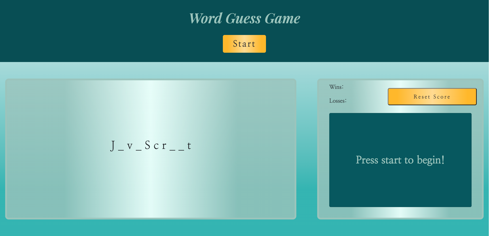

# Word Guess Game

## [Word-Guess-Game](https://josiemald.github.io/word-guess/)

## [Repository](https://github.com/JosieMald/word-guess)



### Project:
```
Built a game using JavaScript and Web APIs.

* When a user presses a letter key, the user's guess should be captured as a key event.

* When a user correctly guesses a letter, the corresponding blank "_" should be replaced by the letter. For example, if the user correctly selects "a", then "a _ _ a _" should appear. 

* When a user wins or loses a game, a message should appear and the timer should stop. 

* When a user clicks the start button, the timer should reset. 

* When a user refreshes or returns to the browser page, the win and loss counts should persist.

This project was created using DOM manipulation and local storage.
```

### Description
```
A game where a user can play a word guessing game by filling in the blanks. The game is timed and the user can see there total wins and losses on the screen.
```


